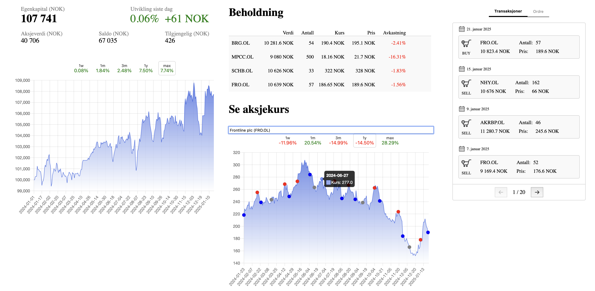

# Stock Price Prediction

This is an application that trades stocks on the Oslo Stock Exchange.

You can access the deployed application at [Stock Price Prediction](https://stock-price-prediction-frontend.onrender.com/).



## Functionality

### Trading

The starting capital was 100k NOK, and the portfolio can consist of up to 10 different stocks.

Models are trained on 20+ companies, using the trading data from the past 200 days, to predict the lowest and highest traded price for the stock for the next 10 days. If the predicted prices for a stock has at least 10% price increase from the low price to the high price, it will be a potential trade. Buy orders are always placed 1% above the predicted low price, and sell orders are placed 1% below the predicted high price. Each evening, after the exchange is closed, a script is ran to determine if orders were executed or not, based on todays prices. Subsequently, new prices are predicted and orders are placed. Sell orders are placed for all stocks in portfolio, while buy orders are placed for the predicted most profitable stcoks, not already in the portfolio.

### Training

Keras is used to train LST models on each individual company. The input is the Open, Close, Low and High price for the stock, and the Volume traded, for each day in the 200 day-period. This is used to predict the lowest and highest price for the next 10 days. For each stock, all available history, until 2022-12-31 is used for training, while the period 2023-01-01 to 2023-12-31 is used for validation during training, and stopping the training when validation loss stops decreasing. The algorithm is backtracked from 2024-01-01 for testing.


## Setup Guide

### Environment Variables
Add a `.env` file in the `frontend/` folder with the following values:
```
NPM_AUTH_TOKEN=personal_token
REACT_APP_BACKEND_URL=http://localhost:2000
```

### Docker
Start the Docker container running the following commands from the root folder:
```
docker compose build --no-cache
docker compose up -d
```

### Backend
To start the backend individually, first install the dependencies, then start the server:
```
cd backend/
pip install -r requirements.txt
python -m src.app
```

### Frontend
To start the frontend individually, run these commands:
```
cd frontend/
npm install
npm start
```
